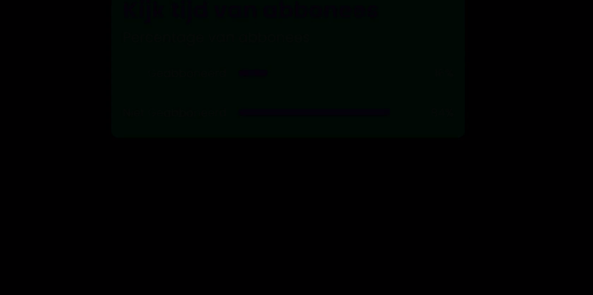

# Remotion video

<p align="center">


Welcome to your Remotion project!

## Commands

**Install Dependencies**

```console
npm i
```

**Start Preview**

```console
npm start
```

## Customize assets
in de index.tsx bestanden van de mappen ```lowerThird ```, ```qrcode ``` of ```subsciberPercent``` kan je variabele vinden om de tekst of url aan te passen. als je dit gedaan hebt ben je klaar om de assets te renderen.

## Render assets
doormiddel van de custom cli hoef je maar een command te runnen, vanuit daar kan je kiezen welke asset je wilt renderen.

## Assets

### Lower third

### QR Code

### Subsciber percent

### Intro
todo
## Outro landscape
todo
### Outro potrait 
todo